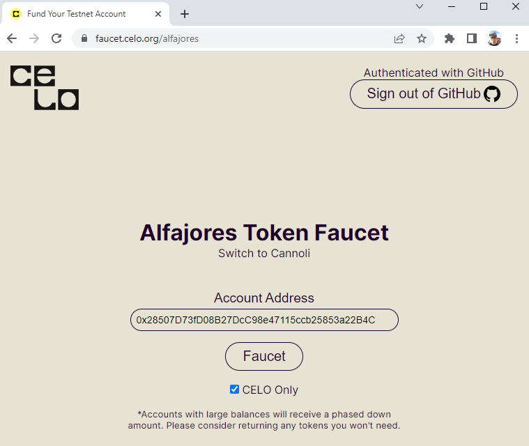

# Mint an NFT with provide-js and Provide Platform!

## Setup

1. Run ```npm install``` to install needed packages

2. Create account on https://shuttle.provide.services

3. Use the postman collection embedded in this repo. 
    i. Enter your Shuttle email and password to the ```{{shutttle_email}}``` and ```{{shuttle_password}}``` collection variables accordingly
    ii. Run 'Get access token with login' request
    iii. Run 'List organizations' request
    iv. Run 'Generate long-dated refresh token' request
    v. Run 'Get access token from refresh token'
    vi. Run create account requests for Polygon and Celo
    vii. Run the 'List accounts' request note the network ids and wallet addresses corresponding to Polygon Mumbai and Celo Alfajores

4. Add your refresh token and other variables to the .env file accordingly. Use .env.sample file for reference.

## Wallet configuration
For these self-custody transactions, you'll need some gas tokens to complete the NFT mint transaction. Use the wallet addresses you noted earlier in 3.vii to request gas from the given network testnet faucet.


Polygon Mumbai : https://faucet.polygon.technology


Celo Alfajores : https://faucet.celo.org/alfajores



Testnet faucet links
[Polygon Mumbai](https://faucet.polygon.technology/)
[Celo Alfajores](https://faucet.celo.org/alfajores)
VeChain - more info soon

## Mint your NFT

Run ```node mintnft``` in you console and see your NFT minted on chain!

## Other info

This example uses a sample ERC-721 contract already deployed here
[Polygon Mumbai](https://mumbai.polygonscan.com/address/0x4e9915b2ff6679c63a290645b589794d89584e5c)
[Celo Alfajores](https://alfajores.celoscan.io/address/0x7e7c0eb2074f499f9010ad3b7c6a20edf9e3346c)
VeChain - coming soon! 

These contracts use the OpenZeppelin ERC721 smart contract template. Check out https://remix.ethereum.org!

For demonstration purposes, we created an un-whitelisted openMint method. Feel free to try this example out with other NFT minting contracts with more advanced whitelisting criteria. Keep in mind the wallet address generated from Shuttle would have to be permitted to mint.

Interested in minting a NFT in SAP ABAP on S/4 HANA ? Check out [this repo!](https://github.com/fleischr/abap-nft)